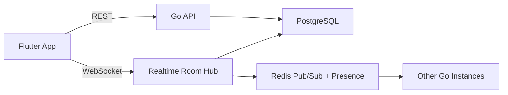

# Caravan Chaos Backend Plan

## Recommendation

Use **Go** for the backend.

The first production-ready stack should be:

- **Language:** Go 1.22+
- **API:** REST for auth, lobby, profiles, match history
- **Realtime:** WebSocket rooms over `nhooyr.io/websocket` or `gorilla/websocket`
- **Router:** `chi` or `gin`; choose `chi` if you want very small dependencies
- **Database:** PostgreSQL
- **Cache / presence / pub-sub:** Redis
- **Protocol v1:** compact JSON messages
- **Protocol v2:** Protobuf only if message volume becomes a real cost
- **Deployment:** one Docker image on Fly.io, Render, Railway, or a small VPS

Go is a good fit here because the game needs many lightweight open WebSocket connections, deterministic server-authoritative rules, and low operational overhead. It is simpler to deploy than a heavy realtime framework and easier to keep predictable than a Node.js service once you have many rooms open.

## Why not start with Firebase or Supabase realtime?

They are good for quick prototypes, but the game has server-authoritative rules, random seeds, anti-cheat validation, reconnect handling, timers, and room broadcasts. A custom WebSocket service gives cleaner control over:

- validating every player action before state changes
- generating server-side randomness
- broadcasting ordered room events
- replaying missed events after reconnect
- supporting async games later

Supabase can still be useful for auth and Postgres hosting, but realtime game state should live in your own service.

## Core architecture



## Server responsibilities

- Create and join rooms.
- Keep authoritative game state.
- Validate player actions.
- Resolve wind draws and event cards on the server.
- Broadcast ordered events to every connected player.
- Persist snapshots and event logs.
- Handle reconnect by sending latest snapshot plus missed events.
- Support bots for solo mode and empty seats.

## Suggested domain model

### Tables

- `users`: account or guest profile.
- `rooms`: lobby state, room code, status, settings.
- `room_players`: seat, display name, connection state.
- `games`: immutable match metadata, random seed, winner.
- `game_events`: ordered append-only events.
- `game_snapshots`: compressed latest state every N events.

### Redis keys

- `presence:{room_id}`: connected players with short TTL.
- `room:{room_id}:lock`: short lock for resolving one action at a time.
- `room_events:{room_id}`: pub/sub channel for horizontal fanout.

## Realtime message shape

Client to server:

```json
{
  "type": "submit_action",
  "roomId": "ABCD",
  "clientSeq": 42,
  "action": {
    "kind": "draw_wind"
  }
}
```

Server to clients:

```json
{
  "type": "state_patch",
  "roomId": "ABCD",
  "serverSeq": 108,
  "events": [
    {
      "kind": "wind_drawn",
      "caravanId": "manta",
      "steps": 3
    }
  ],
  "state": {
    "day": 2,
    "activePlayerId": "u_123"
  }
}
```

## Realtime guarantees

- One action is resolved at a time per room.
- Every room event gets a monotonic `serverSeq`.
- Clients ignore duplicate events by `serverSeq`.
- On reconnect, client sends last seen `serverSeq`.
- Server returns missing events or a fresh snapshot.
- Timers are server-side, never trusted from client clocks.

## MVP phases

1. **Local solo:** Flutter-only game loop with bots.
2. **Online room:** Go service with room create/join and WebSocket broadcast.
3. **Server authority:** Move all game resolution to Go, Flutter sends only intents.
4. **Persistence:** Save event log, snapshots, match history.
5. **Scale path:** Add Redis pub/sub, room affinity, observability, rate limits.

## Flutter integration

Recommended client packages when online mode starts:

- `web_socket_channel` for WebSocket transport.
- `dio` or `http` for REST calls.
- `riverpod` or `bloc` for state management once screens grow.
- `freezed` plus `json_serializable` for typed events after message shapes stabilize.

For the current prototype, avoid extra packages. Keep the game loop in plain Dart until the mechanics settle.
